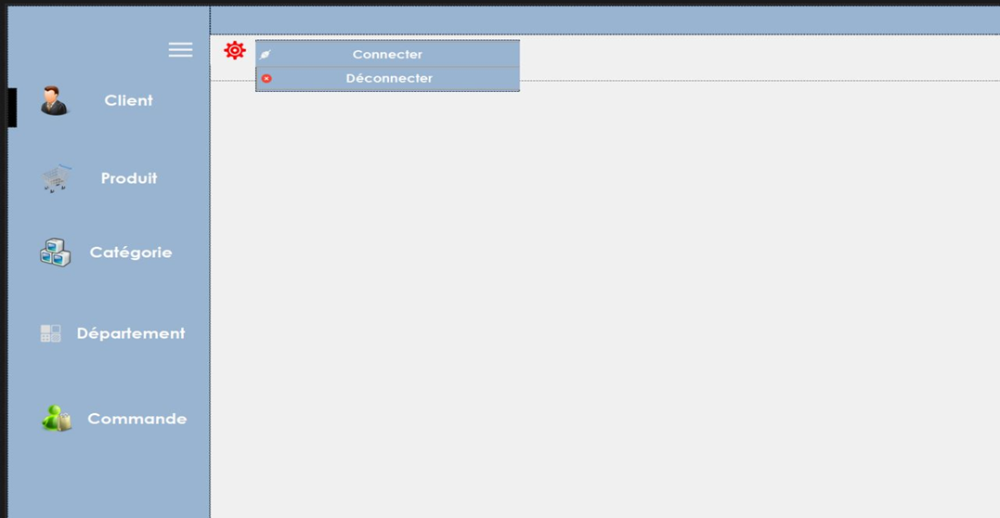
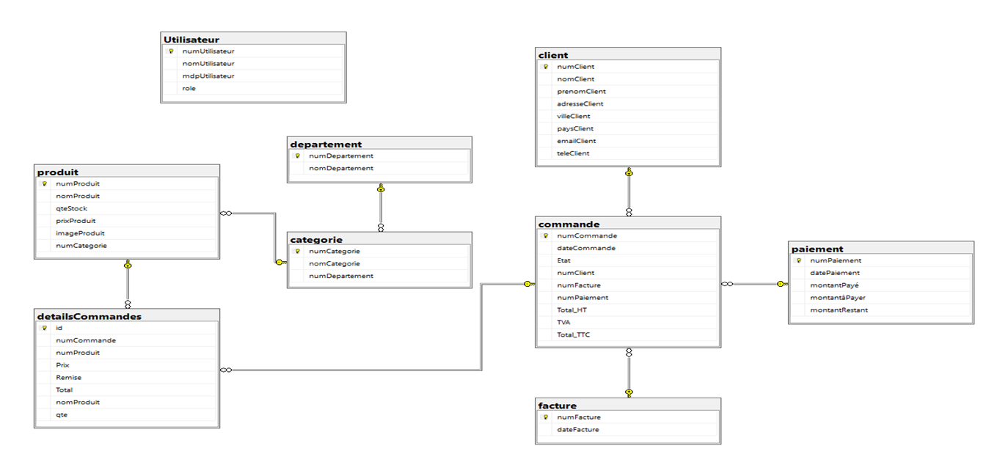
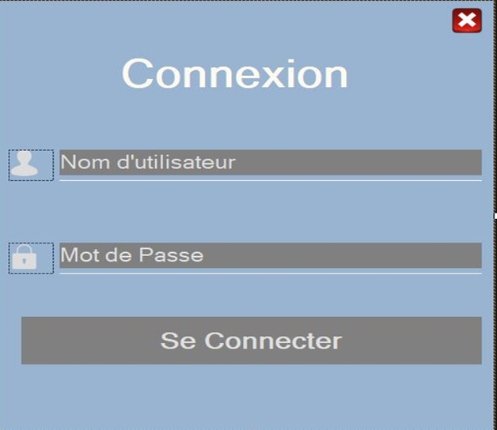
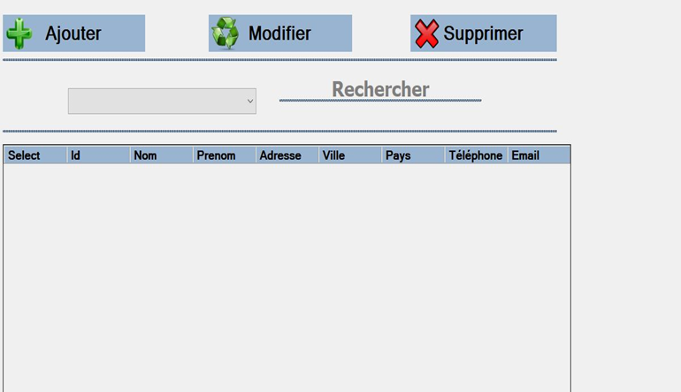
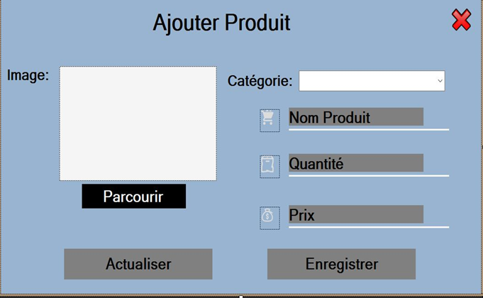
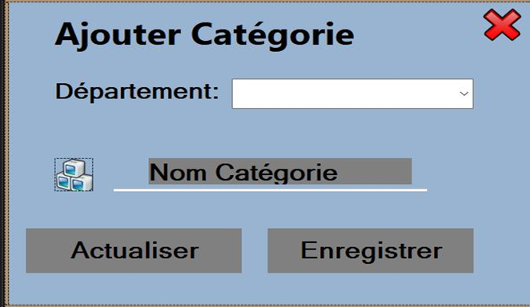
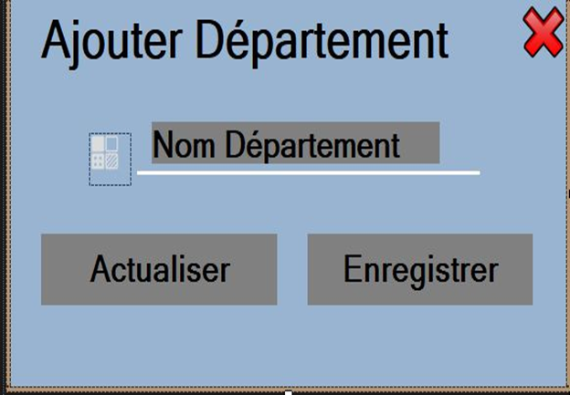
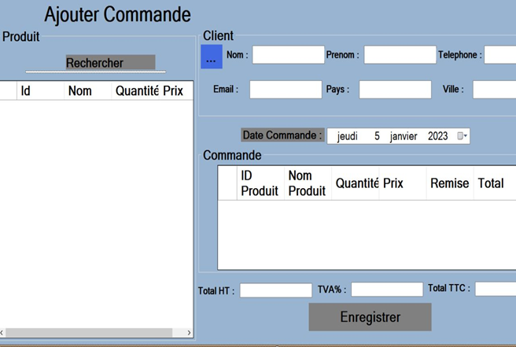

# Gestion de Vente de Produits - Application de Gestion

## Introduction

Ce projet consiste en la conception et le développement d'une application de gestion de vente de produits. L'objectif principal est de fournir une solution efficace pour les vendeurs afin de gérer leurs produits, clients, commandes et catégories de manière organisée et sécurisée. L'application permet de digitaliser les données, d'optimiser le temps de recherche et de réduire les coûts de déplacement.

  
*Capture d'écran de la page d'accueil de l'application*

---

## Fonctionnalités

L'application offre les fonctionnalités suivantes :

1. **Gestion des Clients** :
   - Ajouter, modifier, supprimer et rechercher des clients.
   - Enregistrement des informations clients dans la base de données.

2. **Gestion des Produits** :
   - Ajouter, modifier, supprimer et rechercher des produits.
   - Chaque produit est associé à une image et à une catégorie.

3. **Gestion des Catégories** :
   - Ajouter, modifier, supprimer et rechercher des catégories.
   - Chaque catégorie est associée à un département.

4. **Gestion des Départements** :
   - Ajouter, modifier, supprimer et rechercher des départements.

5. **Gestion des Commandes** :
   - Ajouter des commandes en associant un produit et un client.
   - Calcul automatique du total HT et du total TTC en fonction du prix du produit, de la quantité commandée et du taux de TVA.

---

## Conception

### Diagramme de Classe

Le diagramme de classe de l'application est conçu pour représenter les différentes entités (Client, Produit, Catégorie, Département, Commande) et leurs relations. Chaque entité est gérée par un manager qui assure les opérations CRUD (Create, Read, Update, Delete).

  
*Diagramme de classe de l'application*

---

## Langages et Outils de Développement

- **Langage de programmation** : C#
- **Environnement de développement** : Visual Studio
- **Gestion de base de données** : SQL Server Management Studio (SSMS)

---

## Démonstration

### Connexion

1. Lancez l'application.
2. Cliquez sur le bouton **"Connecter"** pour accéder à la page de connexion.
3. Saisissez votre nom d'utilisateur et votre mot de passe.
4. Si les informations sont correctes, vous serez connecté à l'application.

  
*Capture d'écran de la page de connexion*

---

### Gestion des Clients

1. Cliquez sur le bouton **"Client"** pour afficher la liste des clients enregistrés.
2. Utilisez le bouton **"Rechercher"** pour filtrer les clients.
3. Utilisez les boutons **"Modifier"**, **"Supprimer"** et **"Ajouter"** pour gérer les clients.

  
*Capture d'écran de la gestion des clients*

---

### Gestion des Produits

1. Cliquez sur le bouton **"Produit"** pour afficher la liste des produits enregistrés.
2. Utilisez le bouton **"Rechercher"** pour filtrer les produits.
3. Utilisez les boutons **"Modifier"**, **"Supprimer"** et **"Ajouter"** pour gérer les produits.

  
*Capture d'écran de la gestion des produits*

---

### Gestion des Catégories

1. Cliquez sur le bouton **"Catégorie"** pour afficher la liste des catégories enregistrées.
2. Utilisez le bouton **"Rechercher"** pour filtrer les catégories.
3. Utilisez les boutons **"Modifier"**, **"Supprimer"** et **"Ajouter"** pour gérer les catégories.

  
*Capture d'écran de la gestion des catégories*

---

### Gestion des Départements

1. Cliquez sur le bouton **"Département"** pour afficher la liste des départements enregistrés.
2. Utilisez le bouton **"Rechercher"** pour filtrer les départements.
3. Utilisez les boutons **"Modifier"**, **"Supprimer"** et **"Ajouter"** pour gérer les départements.

  
*Capture d'écran de la gestion des départements*

---

### Gestion des Commandes

1. Cliquez sur le bouton **"Commande"** pour afficher la liste des commandes enregistrées.
2. Utilisez le bouton **"Ajouter"** pour créer une nouvelle commande.
3. Associez un produit et un client à la commande.
4. Le total HT et le total TTC seront calculés automatiquement.

  
*Capture d'écran de la gestion des commandes*

---

## Conclusion

Ce projet a permis de mettre en pratique les connaissances acquises en développement d'applications en C#. L'application offre une solution efficace pour la gestion des ventes de produits, en permettant une digitalisation des données et une optimisation des processus de gestion. Les perspectives d'évolution incluent l'amélioration de l'interface utilisateur et l'ajout de nouvelles fonctionnalités pour répondre aux besoins des utilisateurs.

---

## Perspectives

- Amélioration de l'interface utilisateur.
- Ajout de fonctionnalités supplémentaires telles que la gestion des stocks et des rapports de vente.
- Intégration avec d'autres systèmes de gestion d'entreprise.

---

Ce projet a été réalisé dans le cadre d'une formation en développement d'applications. Pour toute question ou suggestion, n'hésitez pas à contacter l'équipe de développement.